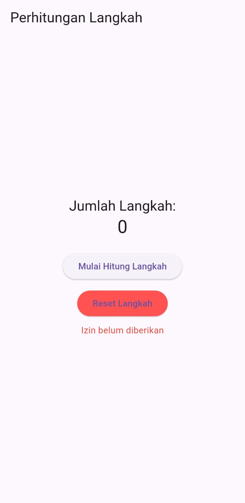
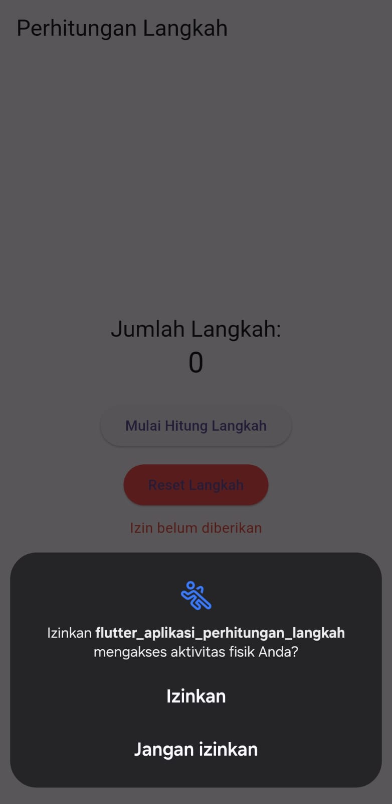
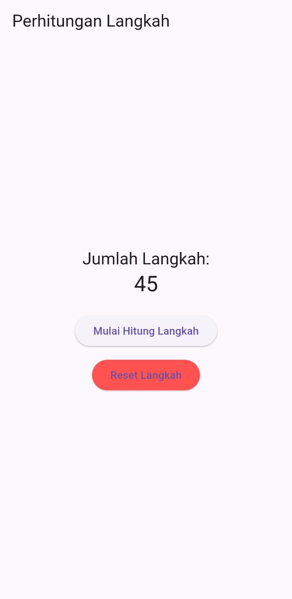

# flutter_aplikasi_perhitungan_langkah

## Nama:
Muhamad Suhuddin Jaballul Karim
## NIM: 
4522210119

## Tujuan Praktikum:
Mempelajari dan mengimplementasikan sensor `pedometer` (penghitung langkah) pada aplikasi Flutter. Praktikum ini bertujuan untuk memahami penggunaan izin `activity_recognition` pada Android, memproses data sensor langkah, dan menyimpan offset data menggunakan `SharedPreferences`.

## Deskripsi Aplikasi:
Aplikasi ini merupakan aplikasi penghitung langkah sederhana berbasis Flutter. Pengguna dapat memulai perhitungan langkah dengan menekan tombol **Mulai Hitung Langkah**, lalu aplikasi akan membaca sensor langkah (step counter) dari perangkat. Data jumlah langkah ditampilkan secara real-time di layar. Pengguna juga dapat mereset perhitungan langkah dengan tombol **Reset Langkah**.

## Screenshot Emulator:
  

 |

## Penjelasan Program:
- Dibangun menggunakan Flutter dan bahasa Dart.
- Menggunakan package:
  - `pedometer` → membaca jumlah langkah dari sensor bawaan Android.
  - `permission_handler` → meminta izin akses aktivitas fisik (`activity_recognition`).
  - `shared_preferences` → menyimpan offset langkah agar nilai langkah tetap valid meskipun aplikasi ditutup.
- Flow aplikasi:
  - Saat tombol **Mulai Hitung Langkah** ditekan, aplikasi meminta izin sensor.
  - Jika diizinkan, sensor mulai menghitung langkah, angka awal disimpan sebagai offset.
  - Nilai langkah yang ditampilkan adalah selisih langkah saat ini dikurangi offset.
  - Tombol **Reset Langkah** akan menghapus offset dan menghentikan stream pedometer.

- Komponen UI menggunakan:
  - `Scaffold`, `Column`, `Text`, `ElevatedButton` untuk layout dasar.
  - `AlertDialog` (`PermissionDialog`) untuk konfirmasi izin.

- Fitur simulasi langkah manual juga dapat ditambahkan jika sensor tidak mendukung output langsung.

## Pengujian Aplikasi:
Aplikasi ini telah diuji pada perangkat **Samsung A55**.  
Sensor langkah terdeteksi melalui aplikasi **Samsung Health**, namun pada percobaan langsung dengan plugin `pedometer`, data langkah tidak keluar karena sensor bawaan tidak terbuka untuk pihak ketiga.  
Pengujian tetap berhasil dengan sinkronisasi offset dan permission di Flutter.

## Cara Menjalankan Aplikasi:
```bash
flutter pub get
flutter run