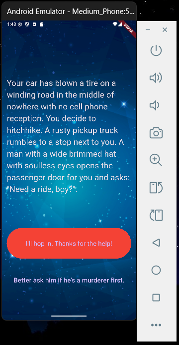

# flutter_destini_app

## Nama:
Muhamad Suhuddin Jaballul Karim
## NIM: 
4522210119

## Tujuan Praktikum:
Mempelajari dan mengimplementasikan aplikasi cerita interaktif menggunakan Flutter. Praktikum ini bertujuan untuk memahami penggunaan `StatefulWidget`, pengelolaan logika bercabang (conditional navigation), serta pemisahan kode menjadi beberapa class untuk menjaga keteraturan dan modularitas.

## Deskripsi Aplikasi:
Aplikasi ini merupakan aplikasi cerita interaktif berbasis pilihan ganda di mana pengguna menentukan alur cerita berdasarkan keputusan yang dipilih. Cerita akan bercabang sesuai pilihan pengguna, dan pada titik-titik tertentu cerita dapat berakhir dan aplikasi akan kembali ke awal.

## Screenshot Emulator:



## Penjelasan Program:
- Aplikasi dibangun dengan **Flutter** menggunakan bahasa pemrograman **Dart**.
- Struktur kode dibagi menjadi 3 file utama:
  - `main.dart`: Menangani UI utama, tampilan cerita, serta navigasi berdasarkan tombol.
  - `story.dart`: Kelas model yang menyimpan data cerita dan dua pilihan jawaban.
  - `story_brain.dart`: Menangani logika cerita dan navigasi percabangan.
  
- Logika Aplikasi:
  - Cerita dimulai dari indeks ke-0 (`_storyNumber = 0`).
  - Pilihan user (Choice 1 atau 2) akan mengubah alur cerita menggunakan fungsi `nextStory()`.
  - Jika berada pada akhir cerita (index 3, 4, atau 5), aplikasi akan menampilkan tombol "Restart" dan menghilangkan tombol kedua.
  - Fungsi `buttonShouldBeVisible()` digunakan untuk menyembunyikan tombol kedua saat tidak relevan.

- Fitur-fitur :
  - Menggunakan widget `TextButton` untuk pilihan cerita.
  - Tampilan dinamis menggunakan `Visibility` untuk mengatur kemunculan tombol.
  - Latar belakang cerita menggunakan gambar dari `assets/images/background.png`.
  - State dikelola menggunakan `setState()` dalam `StatefulWidget`.

## Cara Menjalankan Aplikasi:
```bash
flutter pub get
flutter run

