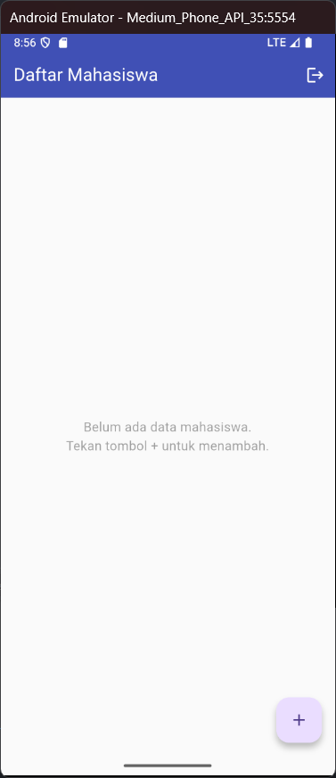
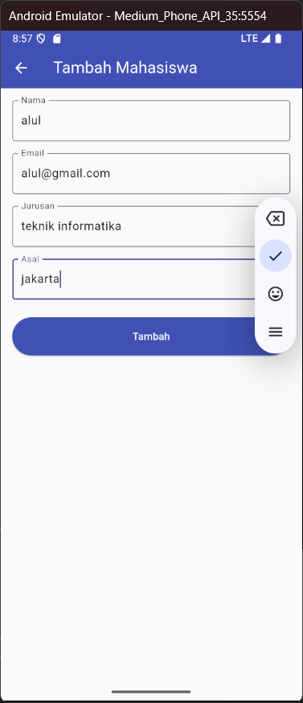
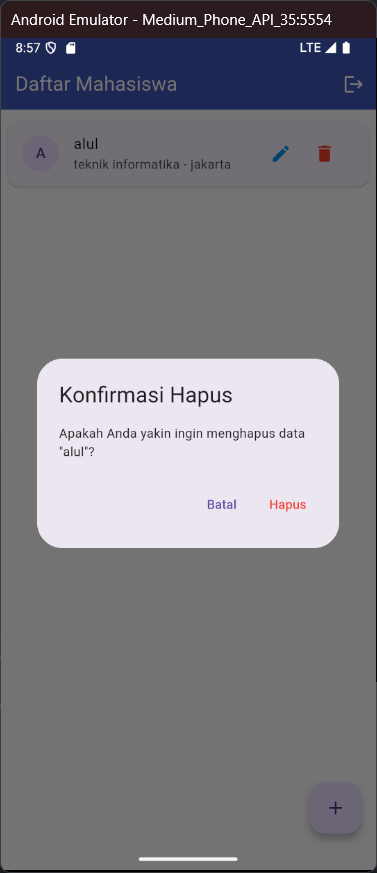

# flutter_sqlite_manajemen_mahasiswa

## Nama:
Muhamad Suhuddin Jaballul karim
## NIM: 
4522210119

## Tujuan Praktikum:
Mempelajari dan mengimplementasikan fitur manajemen data mahasiswa berbasis Flutter menggunakan SQLite (`sqflite`). Praktikum ini bertujuan untuk memahami penggunaan database lokal dalam aplikasi Flutter, serta membuat antarmuka pengguna CRUD (Create, Read, Update, Delete) yang terhubung dengan database SQLite.

## Deskripsi Aplikasi:
Aplikasi ini adalah sistem manajemen data mahasiswa sederhana. Fitur utama mencakup:
- Halaman login untuk admin
- Menampilkan daftar mahasiswa
- Menambahkan data mahasiswa baru
- Mengedit data mahasiswa
- Menghapus data mahasiswa
- Menyimpan data ke dalam database lokal (`students.db`) menggunakan `sqflite`

## Screenshot Emulator:



 |


## Penjelasan Program:

- Aplikasi ini dibuat menggunakan Flutter dan bahasa Dart.
- Struktur file utama:
  - `main.dart`: Inisialisasi aplikasi dan pengaturan tema.
  - `login_page.dart`: Halaman login admin.
  - `main_page.dart`: Halaman utama untuk menampilkan dan mengelola daftar mahasiswa.
  - `student_form_page.dart`: Formulir untuk menambah dan mengedit data mahasiswa.
  - `database_helper.dart`: Kelas untuk mengatur koneksi dan operasi SQLite.

- Dependensi yang digunakan:
  - `sqflite`: Untuk operasi database SQLite.
  - `path` dan `path_provider`: Untuk mendapatkan lokasi penyimpanan database.

- Alur Aplikasi:
  1. Admin login menggunakan username dan password default (`admin`, `password`).
  2. Setelah login, pengguna diarahkan ke halaman utama yang menampilkan daftar mahasiswa.
  3. Tombol tambah (+) digunakan untuk memasukkan data baru mahasiswa.
  4. Setiap data dapat diedit atau dihapus dengan ikon yang tersedia.
  5. Semua perubahan tersimpan di database SQLite lokal.

- Validasi Form:
  - Nama, Jurusan, dan Asal wajib diisi.
  - Email bersifat opsional, namun jika diisi harus valid (mengandung `@`).

## Cara Menjalankan Aplikasi:

```bash
flutter pub get
flutter run
