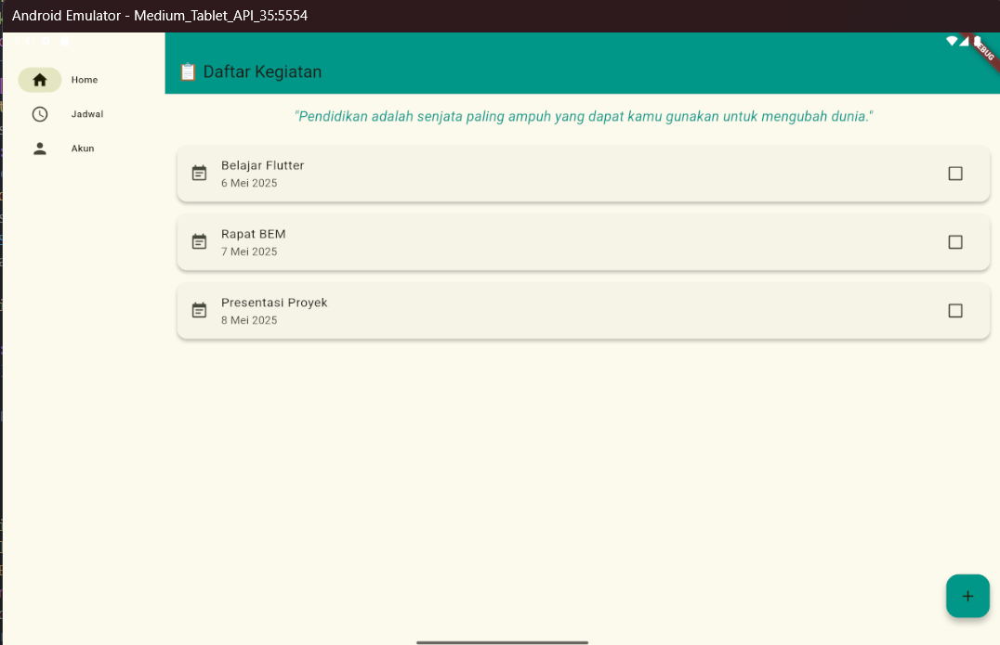

# flutter_uts_aplikasi_jadwal_kuliah_dan_kegiatan_mahasiswa_adapatif_interaktif

## Nama:
Muhamad Suhuddin Jaballul Karim, NIM: 452210119

## Deskripsi Aplikasi:
Aplikasi ini berfungsi sebagai manajemen kegiatan dan jadwal mahasiswa. Fitur-fitur baru yang ditambahkan antara lain: tampilan adaptif dan responsif, pengaturan tema (gelap/terang), penggantian warna tema, serta penggunaan Floating Action Button untuk menambahkan kegiatan secara dinamis.

## Screenshot Emulator:

## Penjelasan Program:
- Program ini menggunakan NavigationRail untuk layar lebar (tablet) dan BottomNavigationBar untuk layar kecil (hp), menyesuaikan ukuran layar secara otomatis.
- Program ini Menampilkan daftar kegiatan mahasiswa. Kegiatan dapat ditambah melalui FloatingActionButton dan dihapus otomatis setelah ditandai selesai.
- Program ini menampilkan jadwal mata kuliah harian dari senin hingga jumat beserta jam dimulainya perkuliahan 
- Program ini menampilkan informasi pengguna serta menyediakan fitur pengaturan Mode Gelap 
- program ini menampilkan quote dengan animasi fade in yang dapat dilihat oleh para pengguna pada halaman kegiatan

## Cara Menjalankan Aplikasi:
flutter pub get flutter run