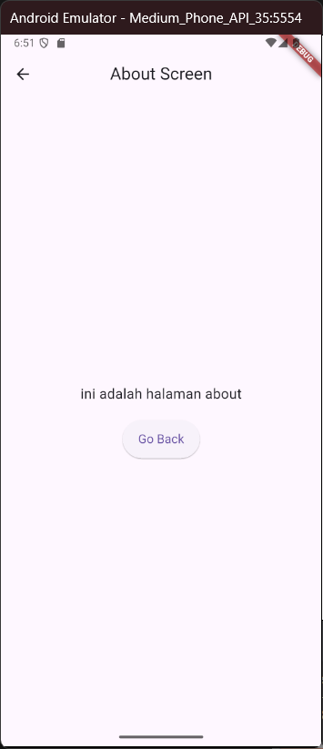
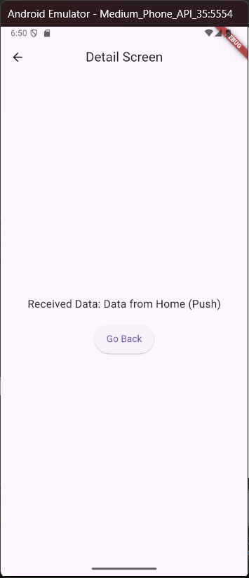
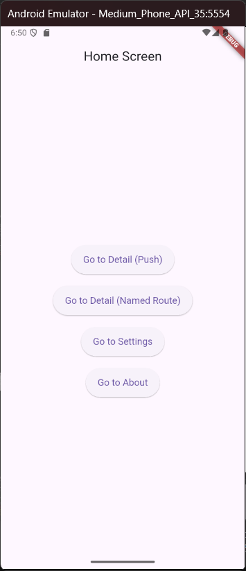
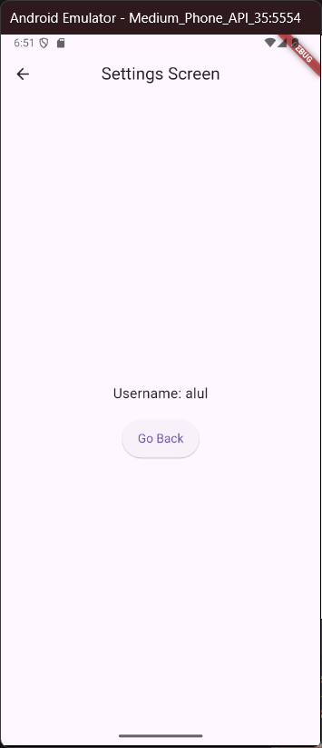

# Nama:
Muhamad Suhuddin Jaballul Karim
# NPM:
4522210119

## Tujuan Praktikum
Praktikum ini bertujuan untuk memahami dan mempraktikkan penerapan navigasi antar layar di Flutter menggunakan named routes dan MaterialPageRoute. Dengan menggunakan arsitektur ini, pengguna dapat bernavigasi antara beberapa layar (screens) dalam aplikasi dan mentransfer data antar layar tersebut.

## Deskripsi Aplikasi
Aplikasi ini adalah contoh implementasi dasar dari navigasi Flutter. Aplikasi ini memungkinkan pengguna untuk berpindah antar layar menggunakan named routes dan MaterialPageRoute dengan beberapa tombol navigasi yang mengarah ke layar yang berbeda. Terdapat beberapa layar utama yang diimplementasikan, antara lain:
- Home Screen: Layar utama yang menampilkan tombol navigasi untuk berpindah ke layar lain.
- Detail Screen: Layar yang menampilkan data yang diteruskan dari HomeScreen atau menggunakan named route.
- Settings Screen: Layar pengaturan yang menampilkan data argumen yang dikirimkan melalui Navigator.pushNamed.
- About Screen: Layar yang menjelaskan tujuan aplikasi.

## Screenshot Halaman

## Penjelasan Program
- Navigasi menggunakan pendekatan Navigator 1.0:
    - Navigator.push() untuk navigasi langsung dengan parameter konstruktor.
    - Navigator.pushNamed() untuk navigasi menggunakan route name.
- Daftar named route didefinisikan dalam MaterialApp.routes:
    - '/' → HomeScreen
    - '/detail' → DetailScreen
    - '/settings' → SettingsScreen
    - '/about' → AboutScreen
- HomeScreen menampilkan 4 tombol navigasi:
    - Navigasi ke DetailScreen dengan data melalui push
    - Navigasi ke DetailScreen via named route
    - Navigasi ke SettingsScreen dengan arguments
    - Navigasi ke AboutScreen via named route
- DetailScreen menerima parameter data secara langsung via konstruktor.
- SettingsScreen menerima data username melalui ModalRoute.of(context)?.settings.arguments.
- AboutScreen menampilkan informasi versi dan deskripsi aplikasi.
- UI disusun menggunakan widget dasar seperti:
Scaffold, AppBar, Column, Center, Text, ElevatedButton, dan SizedBox.

## Cara Menjalankan Program
flutter pub get