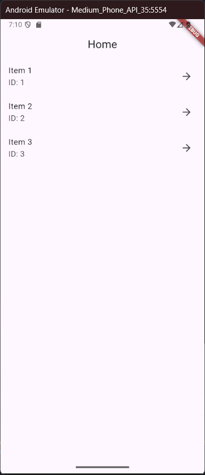
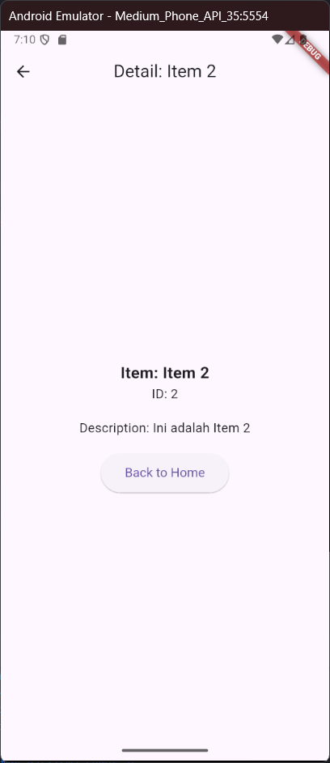

# Nama:
Muhamad Suhuddin Jaballul Karim
# NPM:
4522210119

## Tujuan Praktikum
Praktikum ini bertujuan untuk mempelajari dan mengimplementasikan navigasi antar halaman (screen) di Flutter menggunakan Navigator 2.0, di mana navigasi dilakukan secara deklaratif. Praktikum ini juga bertujuan untuk memahami cara mengelola state dalam aplikasi dan menggunakan data dinamis di antara halaman-halaman dalam aplikasi.

## Deskripsi Aplikasi
Aplikasi ini adalah contoh sederhana yang menunjukkan cara melakukan navigasi antar halaman menggunakan Navigator 2.0. Aplikasi ini memiliki dua halaman utama:
- HomeScreen: Layar utama yang menampilkan daftar item.
- DetailScreen: Layar yang menampilkan detail dari item yang dipilih, termasuk deskripsi item.

## Screenshot Halaman

## Penjelasan Program
1. Navigator 2.0:
    - Aplikasi ini menggunakan Navigator 2.0 untuk navigasi antar halaman. Navigasi dilakukan secara deklaratif dengan mendefinisikan halaman-halaman menggunakan MaterialPage dalam widget Navigator. Halaman yang aktif ditampilkan berdasarkan state yang dikelola oleh aplikasi.
    - State Management: HomeScreen mengelola state dari item yang dipilih, yang kemudian digunakan untuk menavigasi ke DetailScreen.
2. Item Class:
    - Item adalah kelas yang merepresentasikan sebuah item dengan tiga atribut: id, name, dan description. Atribut description adalah tambahan baru yang menyimpan informasi tentang item
3. HomeScreen:
    - HomeScreen menampilkan daftar item menggunakan ListView.builder. Setiap item yang dipilih akan mengarah ke DetailScreen yang menampilkan informasi lengkap tentang item tersebut. Navigasi ini dilakukan menggunakan Navigator 2.0 dengan deklarasi halaman yang sesuai.
4. DetailScreen:
    - DetailScreen menampilkan informasi detail dari item yang dipilih, termasuk nama, ID, dan deskripsi item. Selain itu, ada tombol "Back to Home" yang memungkinkan pengguna kembali ke HomeScreen.

## Cara Menjalankan Program
flutter pub get