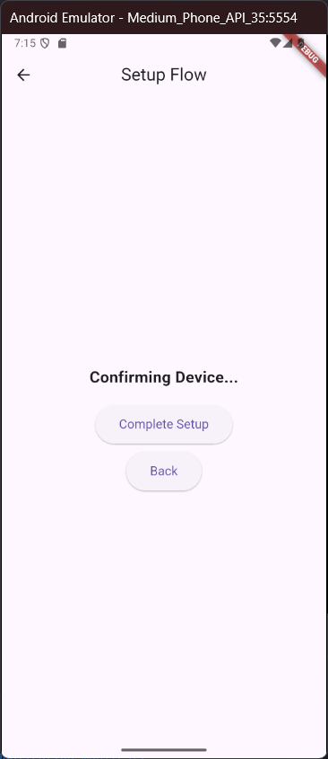
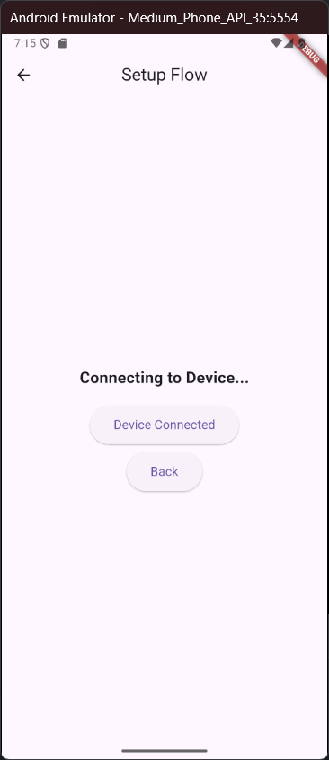
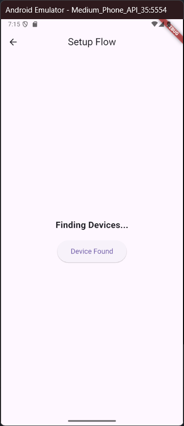
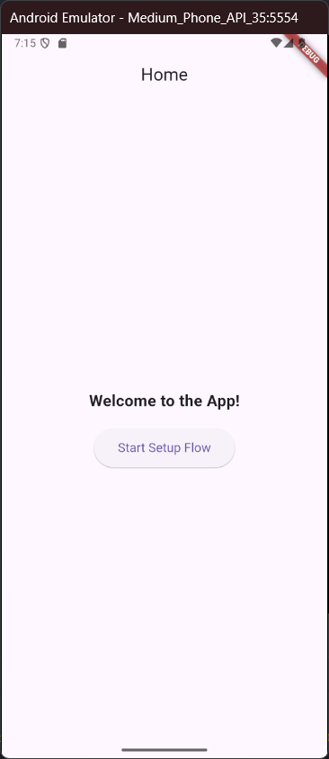

# Nama:
Muhamad Suhuddin Jaballul Karim
# NPM:
4522210119

## Tujuan Praktikum
Tujuan praktikum ini adalah untuk memahami konsep nested navigation dalam aplikasi Flutter. Praktikum ini bertujuan untuk mempelajari serta mengelola navigasi dalam aplikasi yang memiliki beberapa lapisan (nested) menggunakan widget Navigator secara deklaratif. Aplikasi ini juga bertujuan untuk mempelajari cara mengelola state dan peralihan antar halaman (screen) dalam proses yang lebih kompleks.

## Deskripsi Aplikasi
Aplikasi ini merupakan contoh implementasi dari nested navigation di Flutter. Aplikasi ini menggambarkan alur pengaturan perangkat melalui beberapa langkah dengan navigasi antar layar yang berbeda.
Aplikasi ini memiliki dua lapisan navigasi:
1. HomeScreen: Halaman utama yang menyambut pengguna dan memberikan tombol untuk memulai alur pengaturan.
2. SetupFlowScreen: Halaman ini menggunakan nested navigation, dengan navigasi lebih lanjut ke beberapa langkah berikutnya, yaitu:
    - FindDevicesScreen: Mencari perangkat.
    - ConnectDeviceScreen: Menghubungkan perangkat.
    - ConfirmDeviceScreen: Mengonfirmasi perangkat yang terhubung.

## Screenshot Halaman

## Penjelasan Program
1. MyApp
    - MyApp adalah widget utama yang membungkus aplikasi dan mendefinisikan tema aplikasi. Aplikasi ini memulai dengan HomeScreen sebagai layar pertama yang ditampilkan.
    - MaterialApp digunakan dengan navigasi berbasis Navigator 2.0 yang mengatur alur dan rute aplikasi.
2. HomeScreen:
    - HomeScreen adalah layar utama yang menyambut pengguna dengan tombol untuk memulai SetupFlowScreen.
    - Ketika tombol "Start Setup Flow" ditekan, aplikasi akan menavigasi ke SetupFlowScreen.
3. SetupFlowScreen (Nested Navigation):
    - SetupFlowScreen mengimplementasikan nested navigation. Di sini, sebuah Navigator digunakan untuk menangani langkah-langkah pengaturan. Ada tiga langkah utama: Find Devices, Connect Device, dan Confirm Device.
    - Di setiap langkah, navigasi dilakukan secara terpisah menggunakan named routes yang dikelola dalam onGenerateRoute.
4. FindDevicesScreen, ConnectDeviceScreen, ConfirmDeviceScreen:
    - Ketiga layar ini adalah bagian dari nested navigation dan masing-masing menangani langkah-langkah yang berbeda dalam proses pengaturan:
        - FindDevicesScreen: Menampilkan tombol untuk memulai pencarian perangkat.
        - ConnectDeviceScreen: Menampilkan tombol untuk menghubungkan perangkat.
        - ConfirmDeviceScreen: Menampilkan tombol untuk mengonfirmasi pengaturan dan menyelesaikan alur.

## Cara Menjalankan Program
flutter pub get