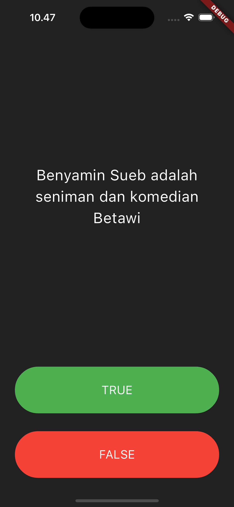
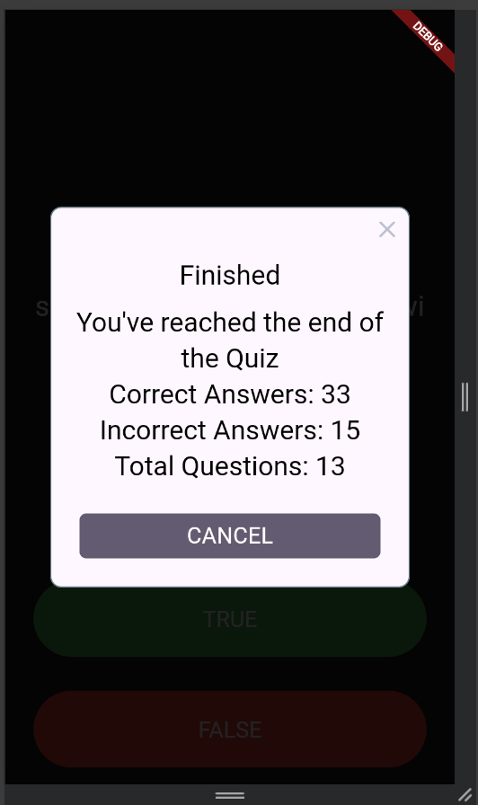

# flutter_kuis_benar_salah

## Nama:
Mahardika Rafaditya Dwi Putra Hastomo, NIM: 4522210146

## Tujuan Praktikum:
Mempelajari dan mengimplementasikan logika kuis berbasis true/false menggunakan Flutter. Praktikum ini juga bertujuan untuk memahami penggunaan `StatefulWidget`, manajemen state, dan package eksternal seperti `rflutter_alert`.

## Deskripsi Aplikasi:
Aplikasi ini merupakan kuis interaktif dengan format pertanyaan benar/salah seputar tokoh Betawi, Benyamin Sueb. Pengguna akan memilih jawaban dan menerima feedback secara langsung. Aplikasi mencatat jumlah jawaban benar dan salah, serta menampilkan ringkasan hasil saat kuis selesai.

## Screenshot Emulator:



## Penjelasan Program:
- Aplikasi dibangun dengan **Flutter** menggunakan bahasa pemrograman **Dart**.
- Terdapat 3 file utama:
  - `main.dart`: UI utama dan pengaturan quiz logic.
  - `question.dart`: Kelas model untuk menyimpan pertanyaan dan jawaban.
  - `quiz_brain.dart`: Manajemen pertanyaan dan navigasi kuis.
- Struktur logika:
  - Setiap pertanyaan ditampilkan satu per satu.
  - Jawaban pengguna akan dibandingkan dengan jawaban benar.
  - Score visual ditampilkan melalui icon ✅ atau ❌ di bawah layar.
  - Setelah pertanyaan terakhir, muncul alert menggunakan `rflutter_alert`.
  - Kuis akan di-reset setelah alert ditutup.
- Fitur-fitur penting:
  - Button `TextButton` dengan warna berbeda untuk TRUE dan FALSE.
  - Feedback visual menggunakan widget `Icon`.
  - Menggunakan `Alert` dari package `rflutter_alert` untuk tampilan ringkasan hasil.
  - State dikelola menggunakan `setState()` di dalam `StatefulWidget`.

## Daftar Pertanyaan:
Terdiri dari 13 pertanyaan seputar:
- Tokoh Benyamin Sueb.
- Budaya Betawi.
- Trivia tentang film, musik, dan karakter-karakter fiktif.

## Cara Menjalankan Aplikasi:
```bash
flutter pub get
flutter run