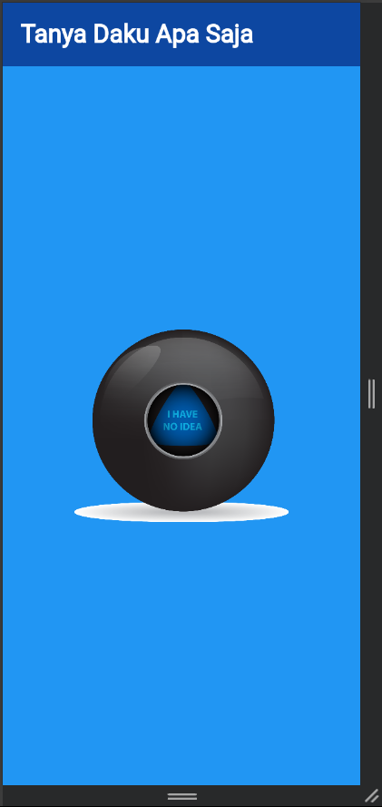
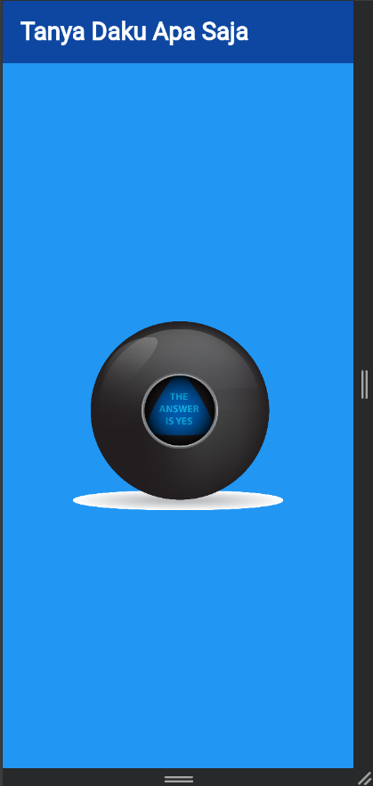
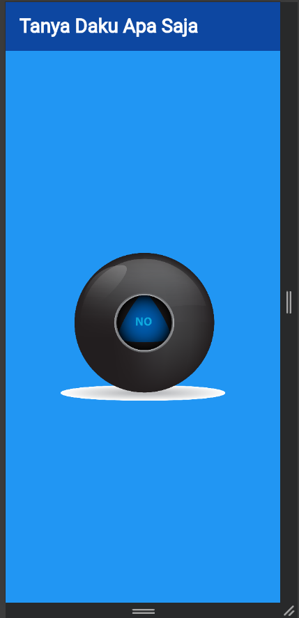

# flutter_tanya_daku

## Nama:
Muhamad Suhuddin Jaballul Karim, NIM: 452221019

## Tujuan Praktikum:
Mempelajari dan mengimplementasikan logika acak (random logic) dan pengelolaan state menggunakan `StatefulWidget` dalam aplikasi Flutter. Praktikum ini juga bertujuan untuk memahami cara memanipulasi UI berdasarkan aksi pengguna.

## Deskripsi Aplikasi:
Aplikasi ini merupakan simulasi dari permainan “bola ajaib” (magic ball) yang memberikan jawaban acak setiap kali gambar bola ditekan. Gambar akan berubah secara acak dari 5 kemungkinan jawaban yang tersedia.

## Screenshot Emulator:






## Penjelasan Program:
- Aplikasi dibangun menggunakan **Flutter** dan bahasa pemrograman **Dart**.
- Terdapat satu halaman utama (`HalamanBola`) yang menampilkan judul dan komponen `Bola`.
- Komponen `Bola` menggunakan `StatefulWidget` untuk memanipulasi tampilan gambar berdasarkan nilai acak.
- Gambar diubah menggunakan fungsi `Random().nextInt(5) + 1`, yang akan memilih salah satu dari 5 gambar (ball1.png s.d. ball5.png).
- Setiap kali tombol (yang berupa gambar bola) ditekan, fungsi `setState()` dipanggil untuk memperbarui tampilan gambar.
- UI dibangun menggunakan widget dasar seperti:
  - `MaterialApp`, `Scaffold`, `AppBar`, `Center`, `TextButton`, `Image.asset`.

## Cara Menjalankan Aplikasi:
```bash
flutter pub get
flutter run