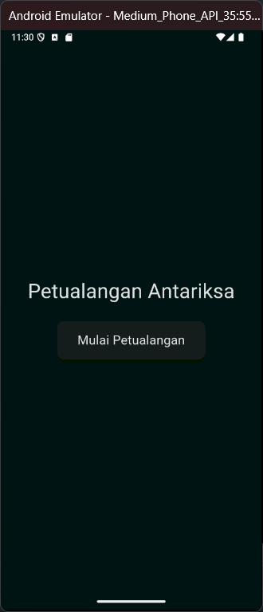
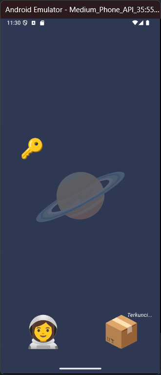
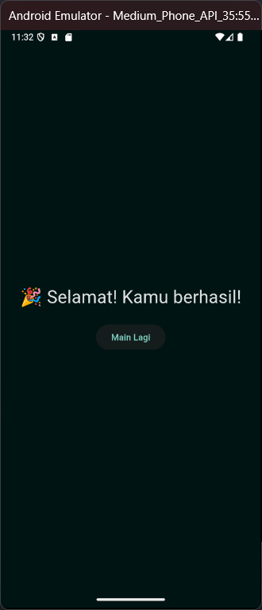

# Nama:
Jieo
# NPM:
4522210157

## Tujuan Praktikum
Tujuan dari praktikum ini adalah untuk mempelajari pembuatan aplikasi interaktif berbasis Flutter dengan fokus pada interaksi pengguna dan pengenalan berbagai elemen UI seperti gesture detection, animasi, dan transisi antar halaman. Beberapa konsep yang dipelajari antara lain:
1. Penerapan **gesture detection** seperti drag, long press, dan double tap.
2. Implementasi **page navigation** menggunakan `PageView` untuk transisi antar halaman.
3. Penggunaan **state management** untuk memperbarui tampilan aplikasi berdasarkan interaksi pengguna.
4. Membuat **UI dinamis** dengan menggunakan widget seperti `Positioned`, `GestureDetector`, dan `InteractiveViewer`.

## Deskripsi Aplikasi
Aplikasi ini adalah sebuah cerita interaktif yang terdiri dari tiga halaman utama:
1. **Halaman Judul**: Menampilkan judul aplikasi dan tombol untuk memulai petualangan.
2. **Halaman Scene Interaktif**: Pengguna dapat berinteraksi dengan elemen-elemen pada layar, seperti membuka kotak yang terkunci menggunakan kunci yang bisa dipindahkan.
3. **Halaman Selesai**: Menampilkan pesan kemenangan dan tombol untuk memulai lagi.

## Screenshot Halaman

.png)
.png)
.png)

## Penjelasan Program
1. TitlePage:
    - Pada halaman ini, pengguna akan melihat judul aplikasi dan tombol "Mulai Petualangan". Saat tombol diklik, pengguna akan diarahkan ke halaman berikutnya (halaman scene interaktif).
2. Halaman InteractiveScenePage:
    - Halaman ini memungkinkan pengguna berinteraksi dengan objek-objek pada layar, seperti latar belakang yang dapat digeser, kunci yang dapat dipindahkan, dan peti yang dapat dibuka. Pengguna perlu memindahkan kunci ke peti untuk membukanya.
3. Halaman EndPage:
    - Setelah berhasil membuka peti, pengguna akan melihat halaman ini dengan pesan "Selamat! Kamu berhasil!" dan tombol untuk memulai permainan lagi.

## Cara Menjalankan Program
flutter pub get