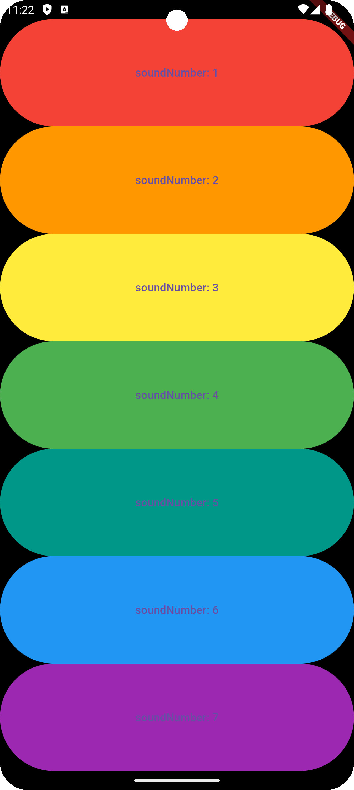

# flutter_xylophone

## Nama:
Mahardika Rafaditya Dwi Putra Hastomo, NIM: 4522210146

## Tujuan Praktikum:
Mempelajari dan mengimplementasikan penggunaan audio player sederhana dalam aplikasi Flutter. Praktikum ini bertujuan untuk memahami bagaimana memutar file audio lokal menggunakan paket audioplayers dan membangun UI dinamis berbasis widget.

## Deskripsi Aplikasi:
Aplikasi ini merupakan simulasi alat musik Xylophone sederhana. Pengguna dapat menekan tombol-tombol berwarna yang masing-masing akan memutar suara not tertentu. Aplikasi ini menampilkan pemetaan suara terhadap warna dan nomor notasi musik.

## Screenshot Emulator:


## Penjelasan Program:
- Aplikasi dibangun menggunakan framework Flutter dan bahasa pemrograman Dart.
- Menggunakan package audioplayers untuk memainkan file audio lokal (format .wav) dari folder assets.
- Fungsi utama:
  - playSound(int soundNumber): Memutar file audio note{soundNumber}.wav saat tombol ditekan.
  - buildKey(): Membuat tombol dengan warna berbeda dan mengikatnya dengan fungsi playSound sesuai dengan urutan.
- UI menggunakan:
  - MaterialApp dan Scaffold sebagai kerangka utama aplikasi.
  - SafeArea untuk menjaga tampilan dalam batas area aman layar.
  - Column dan Expanded untuk menyusun tombol vertikal yang proporsional.
  - TextButton sebagai elemen tombol, dengan warna latar belakang dan fungsi pemutaran audio.

- Struktur warna dan suara:
  - Tombol 1 → Warna Merah → note1.wav
  - Tombol 2 → Warna Oranye → note2.wav
  - Tombol 3 → Warna Kuning → note3.wav
  - Tombol 4 → Warna Hijau → note4.wav
  - Tombol 5 → Warna Teal → note5.wav
  - Tombol 6 → Warna Biru → note6.wav
  - Tombol 7 → Warna Ungu → note7.wav

## Cara Menjalankan Aplikasi:
flutter pub get flutter run

## Notes
1. Pastikan sudah menginstal Flutter SDK.
2. Menggunakan Java version 17
3. Menggunakan ndk version 27.0.12077973
4. Tambahkan dependensi audioplayers pada pubspec.yaml:
```yaml
dependencies:
  audioplayers: ^5.2.1